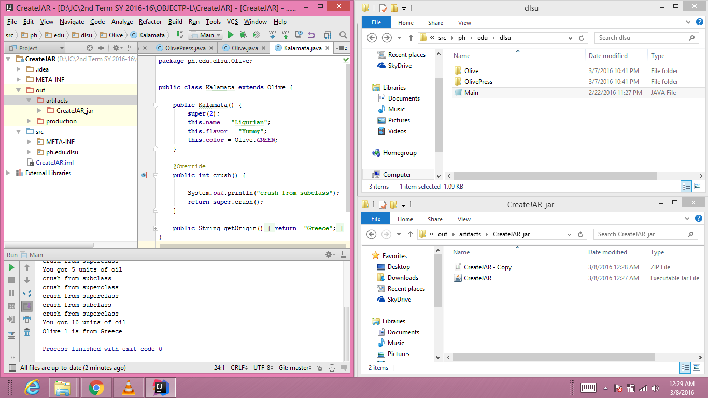

# JavaDocs.

##CODE

~~~
Code will depend on the project you are trying to add in a documentation file
~~~

##PROCESS

~~~
This applies on IntelliJ IDE

Add important comments on your source codes
Tools > Generate JavaDoc > Set the output directory > Ok
~~~
